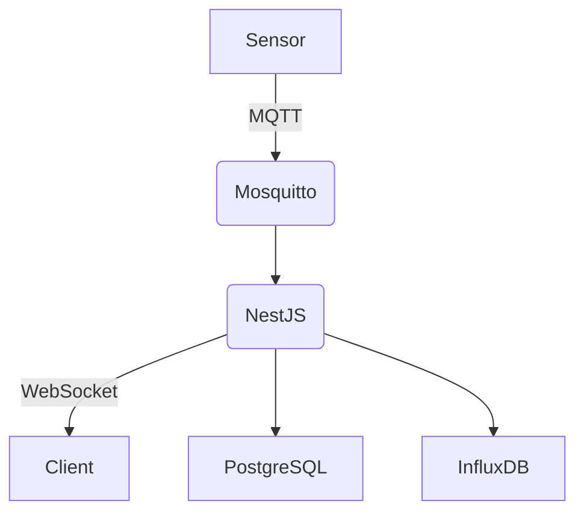

# 🧠 Akıllı Sensör Takip Sistemi (IoT + NestJS)

Bu proje, bir fabrikanın IoT sensörlerinden gelen verileri MQTT protokolü ile toplayan, InfluxDB üzerinde saklayan ve WebSocket üzerinden gerçek zamanlı yayınlayan akıllı bir takip sistemidir. Ayrıca sistemde kullanıcı yönetimi, log takip mekanizması ve güvenlik katmanları mevcuttur.

## 📦 Teknoloji Stack

- **Backend:** Node.js (NestJS)
- **Gerçek Zamanlı Veri:** MQTT (Mosquitto), WebSocket
- **Veritabanı:** PostgreSQL (kullanıcı verisi), InfluxDB (sensör verisi)
- **Kimlik Doğrulama:** JWT
- **Frontend:** React (dashboard)
- **Containerization:** Docker & Docker Compose

## 🧱 Mimari Genel Bakış



## 🧑‍💼 Kullanıcı Roller

- **System Admin:** Tüm sistem üzerinde tam yetki (diğer kullanıcılar tarafından görünmez).
- **Company Admin:** Şirket kullanıcılarını yönetir, IoT cihazları görüntüler.
- **User:** Sadece yetkili olduğu sensör verilerini görüntüler.

## 📡 MQTT Veri Formatı

```json
{
  "sensor_id": "temp_sensor_01",
  "timestamp": 1710772800,
  "temperature": 25.4,
  "humidity": 55.2
}
```

## 🔒 Güvenlik Katmanları

- JWT doğrulama
- MQTT TLS/SSL şifreleme
- Rate limiting (DDoS koruması)
- Rol bazlı erişim kontrolü (Guard sistemi)
- Loglara sadece admin erişimi

## 📘 API Dökümantasyonu

Daha fazla bilgi için [api.md](./API.md) dosyasına göz atın.

## 🐳 Kurulum

```bash
# Projeyi klonlayın
git clone https://github.com/enespaladev/patrion.git
cd patrion

# Ortam değişkenlerini ayarlayın
cp .env.example .env

# Docker üzerinden başlatın
docker compose up --build 
```

## 🔌 .env Değişkenleri

```env
DB_HOST=postgres
DB_PORT=5432
DB_USERNAME=postgres
DB_PASSWORD=secret
DB_NAME=iot_db

JWT_SECRET=supersecretkey
JWT_EXPIRES_IN=3600s

INFLUX_URL=http://influxdb:8086
INFLUX_TOKEN=your_token
INFLUX_ORG=your_org
INFLUX_BUCKET=your_bucket

MQTT_BROKER_URL=mqtts://broker:8883
```

## 📊 Dashboard

Gerçek zamanlı olarak sıcaklık ve nem grafiklerini gösteren arayüz React ile geliştirilmiştir. WebSocket üzerinden canlı veri akışı yapılır.

## ✅ Özellikler

- MQTT üzerinden veri alımı
- InfluxDB’ye veri kaydı
- WebSocket ile canlı yayın
- Kullanıcı yönetimi ve rol kontrolü
- Log sayfası erişim takibi
- TLS/SSL destekli MQTT güvenliği
- Docker ile container yapısı
- REST API + WebSocket endpointleri

